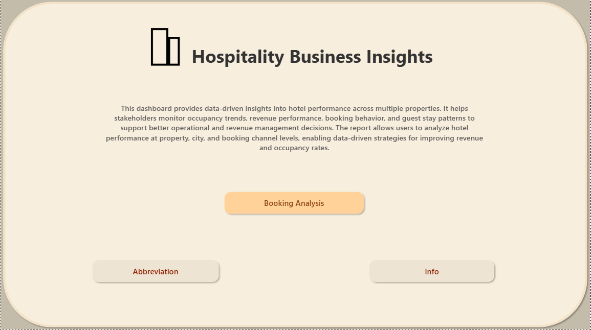
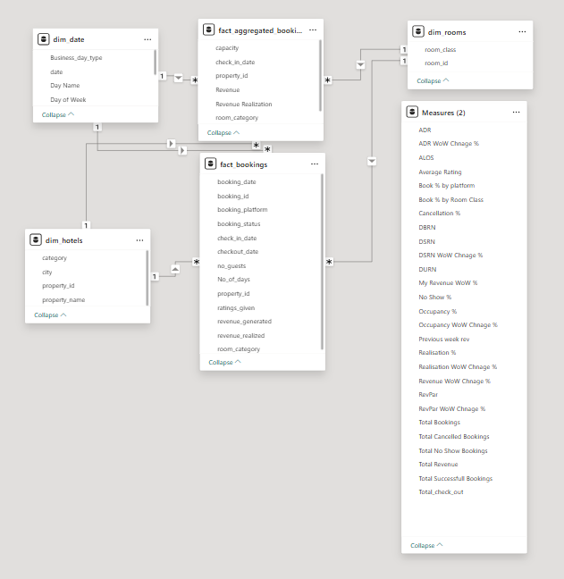
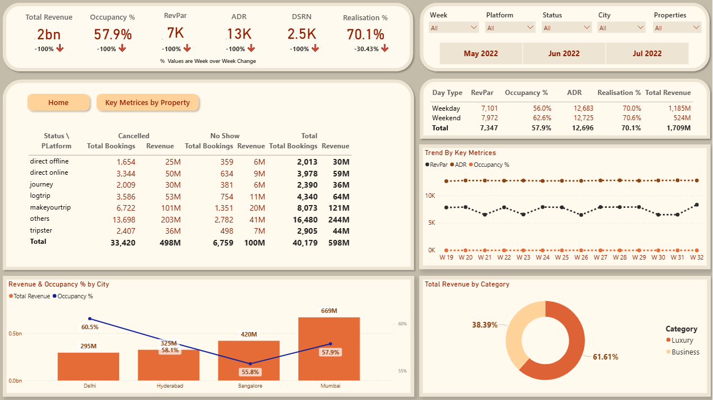
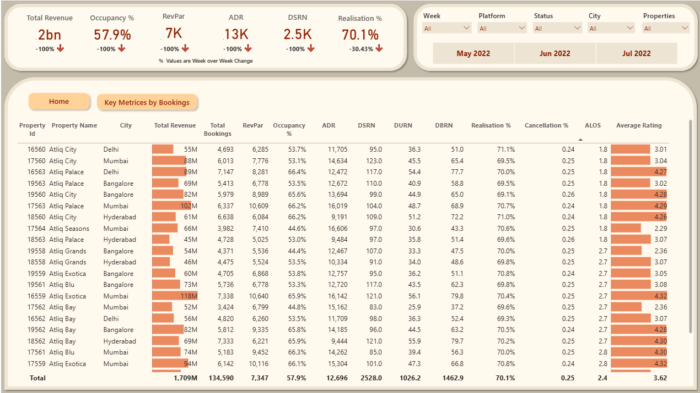
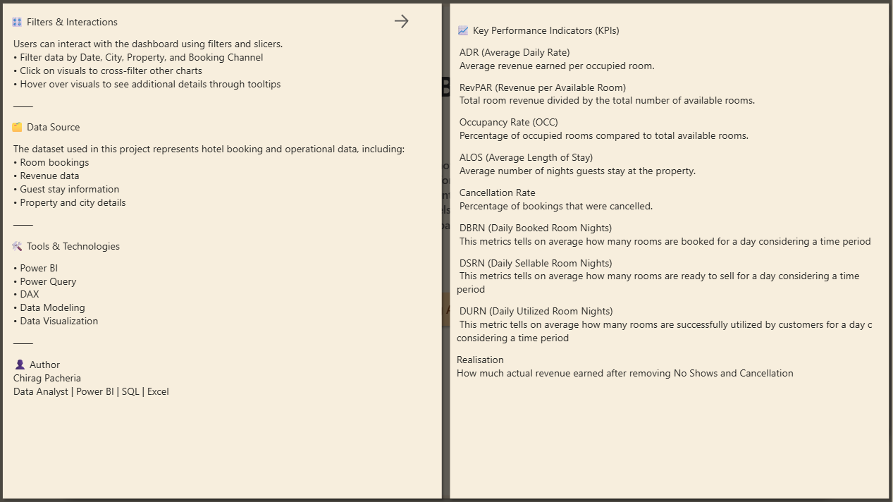

# 🏨 AtliQ Grands – Hospitality Business Insights Dashboard

📌 Situation  

AtliQ Grands, a well-established chain of five-star hotels across India, has been operating successfully for over 20 years. However, due to increasing competition and lack of data-driven decision-making, the company started losing market share and revenue in the luxury and business hotel segment.  

To address this, leadership decided to adopt **Business & Data Intelligence**. Since there was no in-house analytics team, this project focuses on analyzing historical data to generate actionable insights.  

---

🎯 Task  

- Develop key hospitality KPIs from raw data  
- Build an interactive dashboard aligned with stakeholder expectations  
- Identify hidden insights beyond predefined metrics  
- Enable data-driven decision-making for revenue growth  

---

⚙️ Action  

🔹 KPI Development  

- Total Revenue  
- Occupancy %  
- RevPAR (Revenue per Available Room)  
- ADR (Average Daily Rate)  
- DSRN (Daily Sellable Room Nights)  
- Realisation %  
- Week-over-Week (WoW) % change  

---

### 🔹 Dashboard Development (Power BI)  

📊 Filters  
- Week, Month (May–June-July)  
- Booking Platform  
- Booking Status  
- City  
- Hotel Property  

🔹 Key Features  

- Booking Analysis Matrix (Platform & Status breakdown)  
- Toggle View (Home & Property-level deep dive using bookmarks)  
- Day-Type Analysis (Weekday vs Weekend performance)  
- Weekly KPI Trend Analysis  
- City-wise Revenue vs Occupancy comparison  
- Category-wise Revenue split (Luxury vs Business)  

---

## 📊 Dashboard Preview  

---

🔍 Key Insights  

- **Revenue Leakage:**  
  Others (16,480) and MakeyourTrip (8,073) show high cancellations + no-shows → **₹365M+ revenue loss**  

- **City Opportunity:**  
  Mumbai & Bangalore generate highest revenue, while Delhi & Hyderabad lead in occupancy  

- **Demand Trends:**  
  Weekend peaks → RevPAR ₹7,972 and Occupancy 62.6%  

- **Business Dependency:**  
  61% revenue comes from business category  

- **Customer Experience Impact:**  
  Ratings >4 correlate with occupancy >65%  

---

🚀 Impact  

- Identified **₹365M+ revenue leakage**, enabling better booking and pricing strategies  
- Uncovered **demand patterns**, supporting dynamic pricing decisions  
- Delivered a **centralized Power BI dashboard** for faster, data-driven decision-making  

---

📚 Key Learnings  

- Leveraged **advanced Power BI bookmarks** to create interactive navigation and toggle views  
- Effectively used **KPI cards** to highlight key business metrics  
- Built **interactive pop-up/tooltip pages** (via bookmarks) to display additional info and metric definitions  
- Enhanced skills in **dashboard design, usability, and storytelling for stakeholders**  

---

🛠 Tech Stack  

| Tool      | Purpose |
|----------|--------|
| Power BI | Dashboard & Visualization |
| SQL      | Data Analysis |
| Excel    | Data Cleaning |
| DAX      | KPI Calculations |

---

🔗 Connect With Me  

👉 [Portfolio](https://codebasics.io/portfolio/Chirag-Pacheria)  

👉 [Linkedin](https://www.linkedin.com/in/chirag-pacheria-37924a172)

---

🔗 Access Dashboard  

👉 [View Live Dashboard](https://app.powerbi.com/view?r=eyJrIjoiOWU2OGI0NGEtNmEyNS00MzI3LTlkNDUtOTMyZTBiMGJkZGVjIiwidCI6ImM2ZTU0OWIzLTVmNDUtNDAzMi1hYWU5LWQ0MjQ0ZGM1YjJjNCJ9)

---
